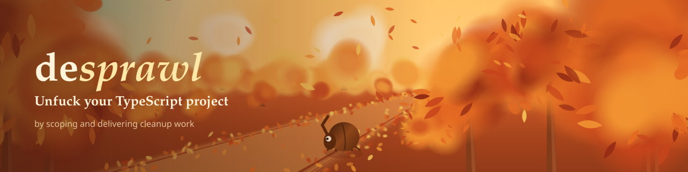

<!-- # desprawl -->

[](https://finnmglas.github.io/desprawl/)\
Visually explore codebases to scope and deliver cleanup work.

```sh
npx desprawl
```

Example architecture analysis (but there's more!):

<picture>
  <source media="(prefers-color-scheme: dark)" srcset=".github/Screenshot_dark.webp">
  <source media="(prefers-color-scheme: light)" srcset=".github/Screenshot_light.webp">
  
</picture>

## What it does

AI-touched repos sprawl: dupe modules, unreachable code, import cycles, deps nobody checked. desprawl reads the repo (files, git, imports, calls, deps) and turns what it finds into scoped, sized cleanup work, not a vague quality score.

- **structure** - imports graphed and grouped into modules
- **execution** - call graph visualized, naming unreachable code, recursion, repetition
- **dependencies** - licence and security issues
- **history** - commits classified by time, module, devs traced
- **tasks** - all cleanups collected, ready to hand off to agents / dev team

UI Tabs: Overview, Modules, Execution, Files, History, Tasks, Graph.\
CLI report + JSON output scriptable and agent ready.

MIT License. Forever no analytics, no tracking, no costs, no ads.

More in [REFERENCE.md](REFERENCE.md). Star this repo, then [fork it](https://github.com/finnmglas/desprawl/fork). See [CONTRIBUTING.md](CONTRIBUTING.md)

[](https://finnmglas.github.io/desprawl/#tab=Modules) [](https://github.com/finnmglas/desprawl/releases) [](https://www.npmjs.com/package/desprawl) [](https://github.com/finnmglas/desprawl)
